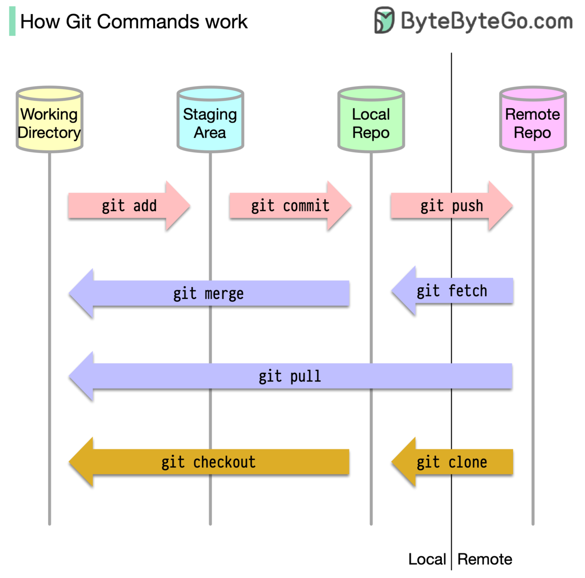

# 🐍 Git + GitHub + Python – ściąga krok po kroku

Instrukcja od zera do pracy w parze: setup środowiska, commity, branche, pull requesty i rozwiązywanie konfliktów.

## 📑 Spis treści

1. [Setup środowiska](#i-setup-środowiska)
2. [Praca na plikach](#ii-praca-na-plikach)
3. [Konflikty (Conflict)](#iii-co-zrobić-gdy-pojawi-się-konflikt-conflict)
4. [Codzienny start](#iv-co-zrobić-po-ponownym-włączeniu-komputera-codzienny-start)
5. [Ściągi graficzne](#v-ściągi-graficzne)

---

# I. Setup środowiska

## 1. Przygotowanie środowiska

- Utwórz konto na GitHubie na maila uczelni: https://github.com/
- Pobierz i zainstaluj następujące narzędzia:
  - **MS Visual Studio Code:** https://code.visualstudio.com/
    - W VSC zaloguj się przez konto GitHub.
    - W *Extensions* wyszukaj i zainstaluj pakiet **Python** od MS (wchodzi w to Pylance, Python Environments i Python Debugger).
  - **Git:** https://git-scm.com/
  - **GitHub CLI:**

    🍎 **Mac** – wpisz w terminalu:

    ```bash
    /bin/bash -c "$(curl -fsSL https://raw.githubusercontent.com/Homebrew/install/HEAD/install.sh)"
    brew install gh
    ```

    🪟 **Windows** – wpisz w cmd:

    ```bash
    winget install --id GitHub.cli
    ```

    > Po instalacji zamknij i otwórz terminal na nowo, inaczej komenda `gh` może nie być widoczna.

## 2. Konfiguracja Gita (cmd lub terminal)

Skonfiguruj swoje dane:

```bash
git config --global user.name "Twoje Imię"
git config --global user.email "twoj@email.com"
```

> Użyj tego samego maila, którego masz na GitHubie – inaczej commity nie będą się przypisywać do Twojego konta.

Zaloguj się na GitHuba:

```bash
gh auth login
```

> Wyklikaj w terminalu/cmd, żeby zalogować się przez przeglądarkę. Sprawdzisz, czy się udało, komendą `gh auth status`.

## 3. Tworzenie projektu, stawianie środowiska i łączenie z Gitem i GitHubem

1. Utwórz folder projektu w wybranej przez siebie lokalizacji.
2. Otwórz folder projektu w VSC.
3. Otwórz terminal w VSC (lewy górny róg, 4. od góry ikonka).
4. Wpisz w terminalu VS Code:

   🪟 **Windows:**

   ```bash
   python -m venv .venv
   ```

   🍎🐧 **Mac / Linux:**

   ```bash
   python3 -m venv .venv
   ```

5. Utwórz w folderze projektu plik o nazwie `.gitignore` i wpisz do niego:

   ```text
   .venv/
   __pycache__/
   ```

6. Wybierz interpreter: `Ctrl+Shift+P` (Mac: `Cmd+Shift+P`) → **Python: Select Interpreter** → wskaż ten z `.venv`.

7. Utwórz lokalne repo i zrób pierwszy commit (bez commita następny krok się nie uda):

   ```bash
   git init
   git branch -M main
   git add .
   git commit -m "init"
   ```

8. Utwórz repozytorium na GitHubie i wrzuć na nie kod:

   ```bash
   gh repo create nazwa-repozytorium --public --source=. --remote=origin --push
   ```

9. Wejdź na GitHuba w przeglądarce w repo, które właśnie stworzyłeś.
10. W ustawieniach (**Settings**), w sekcji **Collaborators**, dodaj drugą osobę. Druga osoba musi zaakceptować zaproszenie (mail albo zakładka *Notifications*) i sklonować repo:

    ```bash
    git clone https://github.com/WLASCICIEL/nazwa-repozytorium.git
    ```

    Potem w sklonowanym folderze tworzy własne `.venv` (krok 4).

---

# II. Praca na plikach

## 1. Pierwszy commit i wrzutka

Najpierw zajmiemy się stworzeniem plików i folderów z instrukcji, żeby zrobić pierwszy commit i wrzucić coś na GitHuba.

**`git status`** – pokazuje, na jakim branchu jesteśmy, co jest w lokalnym repo i które pliki nie są dodane (przyda się mocno później do sprawdzania, na którym branchu jesteś):

```bash
git status
```

**`git add`** – dodaje pliki (jak damy po nim `.`, dodaje wszystko w folderze, w którym jesteśmy):

```bash
git add .
```

**`git commit`** – tworzy nowego commita (wersję) w lokalnym repo:

```bash
git commit -m "komentarz"
```

**`git push`** – wrzuca zcommitowaną wersję na repo na GitHubie:

```bash
git push
```

✅ Sprawdź w przeglądarce, czy zmiany się pokazały.

## 2. Praca równoległa w dwie osoby (Branching & Pull Requests)

Żebyście nie nadpisali sobie nawzajem kodu w tym samym pliku, pracujcie na osobnych gałęziach (*branches*).

**Krok 1.** Pobieramy aktualną wersję z repo z GitHuba:

```bash
git pull origin main
```

**Krok 2.** Tworzymy własnego brancha (`git checkout` pozwala przełączać się między branchami, dopisek `-b` tworzy nowego brancha i od razu na niego przełącza):

```bash
git checkout -b Nazwa-brancha
```

**Krok 3.** Pozmieniaj parę rzeczy, możesz porobić zadania dalej czy coś – ważne, żeby coś się zmieniło w kodzie.

**Krok 4.** Dodajemy zmiany do staging area i puszczamy commita:

```bash
git add .
git commit -m "komentarz"
```

**Krok 5.** Wrzucamy zmiany na GitHuba na tym branchu (`-u` robi to raz, potem wystarczy samo `git push`):

```bash
git push -u origin Nazwa-brancha
```

**Krok 6.** Wejdź na GitHuba w przeglądarce.

**Krok 7.** Kliknij zielony przycisk **"Compare & pull request"**, a następnie zatwierdź (**Create pull request → Merge pull request**), żeby połączyć swój kod z głównym branchem `main`.

**Krok 8.** Po złączeniu kodu wróć do głównego brancha i pobierz najnowszy stan:

```bash
git checkout main
git pull origin main
```

**Krok 9 (opcjonalnie).** Usuń już niepotrzebnego brancha:

```bash
git branch -d Nazwa-brancha
```

> 💡 Przed każdym nowym branchem wracaj na `main` i rób `git pull origin main`, żeby zaczynać od aktualnego kodu.

---

# III. Co zrobić, gdy pojawi się konflikt (Conflict)?

Jeśli przy `git pull origin main` lub `git merge` wyskoczy informacja o konflikcie, oznacza to, że Wy albo ktoś z pary edytowaliście tę samą linię w pliku.

1. Otwórz ten plik w VS Code – zobaczycie znaczniki konfliktów:

   ```text
   <<<<<<< HEAD
   Twoja wersja
   =======
   Wersja z drugiego brancha
   >>>>>>> nazwa-brancha
   ```

2. Wybierzcie ręcznie, która wersja kodu ma zostać (usuwając niepotrzebne znaczniki), a następnie zróbcie normalnie:

   ```bash
   git add .
   git commit -m "fix: resolve merge conflict"
   git push
   ```

> 💡 Najczęściej konflikt pojawia się na pull requeście, bo `main` poszedł do przodu. Wtedy na swoim branchu zrób `git pull origin main`, rozwiąż konflikt jak wyżej i zrób `git push`. PR odświeży się sam.

---

# IV. Co zrobić po ponownym włączeniu komputera (Codzienny start)?

1. Otwórz folder projektu w VS Code.
2. Otwórz terminal w VS Code.
3. Aktywuj wirtualne środowisko (`.venv`):

   🪟 **Windows (PowerShell):**

   ```powershell
   .venv\Scripts\Activate.ps1
   ```

   > Jeśli PowerShell krzyczy o blokadzie skryptów, wpisz raz: `Set-ExecutionPolicy -Scope CurrentUser RemoteSigned` albo użyj wersji CMD.

   🪟 **Windows (CMD):**

   ```bat
   .venv\Scripts\activate.bat
   ```

   🍎🐧 **Mac / Linux:**

   ```bash
   source .venv/bin/activate
   ```

4. Upewnij się, że po lewej stronie linii w terminalu pojawił się napis `(.venv)`.
5. Pobierz najnowszy stan z GitHuba, upewniając się, że jesteś na głównym branchu:

   ```bash
   git checkout main
   git pull origin main
   ```

---

# V. Ściągi graficzne

## Komendy Gita

<p align="center">
  
</p>

## Git cheat sheet

<p align="center">
  
</p>

## Windows CMD cheat sheet

<p align="center">
  
</p>
